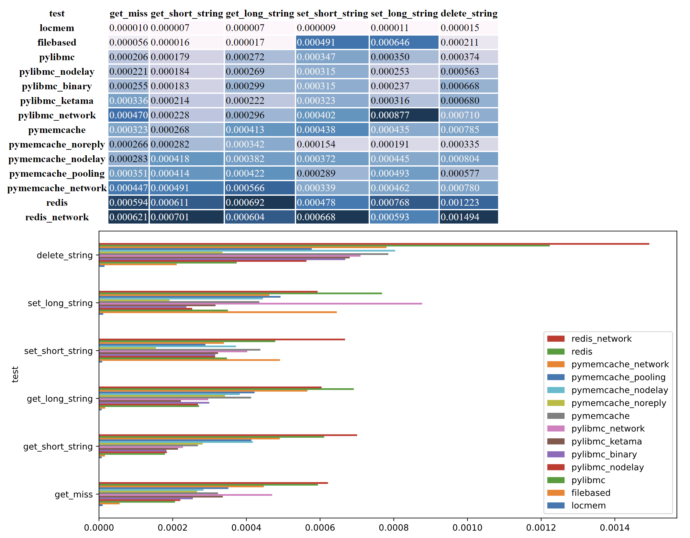

# Conclusion

All the backends are rather fast (less than 1 ms per request), but if you run on a single process, locmem will always be the fastest by far. The only issue is the memory usage of locmem that can be harder to control than using memcached.

For most cases where you do not need cache persistence, use memcached and pylibmc. If you need persistence, use Redis, but Redis is a lot heavier on the system as well as slower.

During tests, no real difference was found between using redis+hiredis or redis only.
